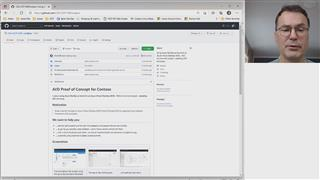
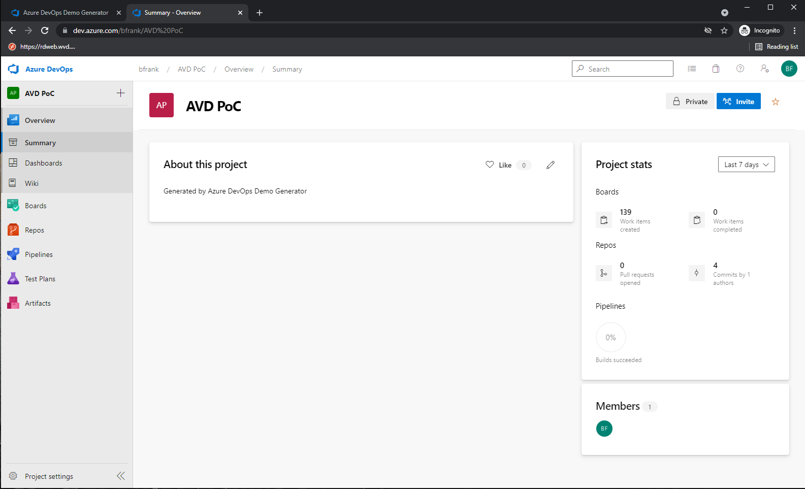
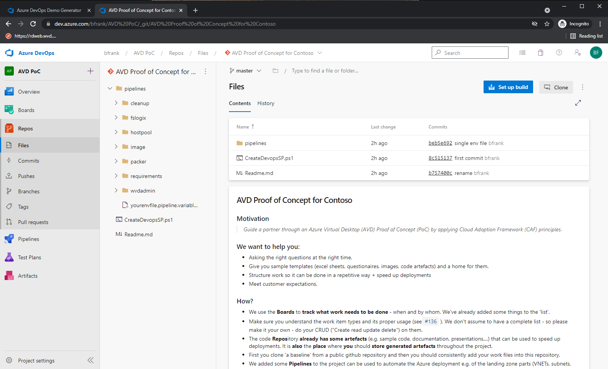
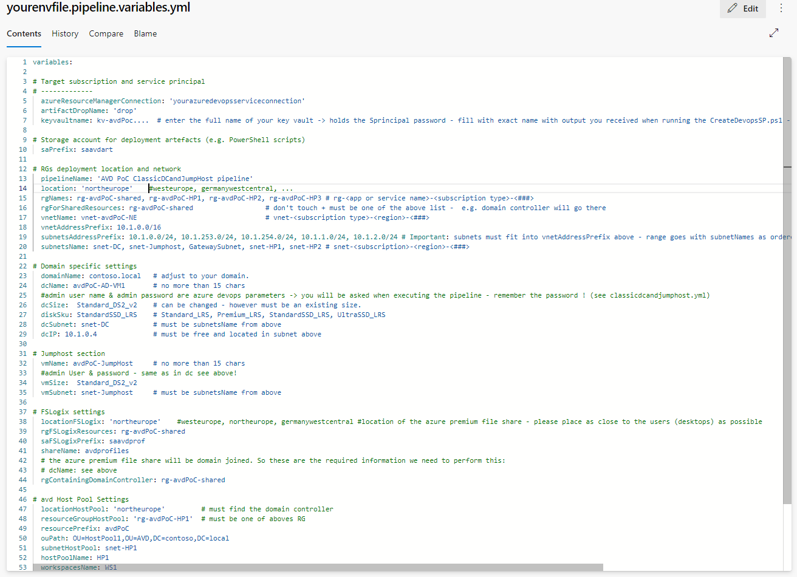
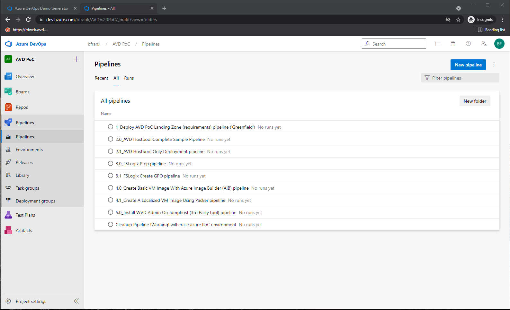

# AVD Proof of Concept for Contoso

Is about **using Azure DevOps as home for an Azure Virtual Desktop (AVD) - PoC** environment project - **adopting CAF** principles.

## Motivation

>*Guide a partner through an Azure Virtual Desktop (AVD) Proof of Concept (PoC) by applying Cloud Adoption Framework (CAF) principles.*

## We want to help you:  

- ... ask the right questions at the right time (especially for people that are new to AVD).
- ... by giving you samples, code artefacts + and a home (version control) for them.
- ... with a list of structured work items - so that an implementation can be done in a repetitive way.
- ... automate using pipelines to speed up deployments

## About / Who and Why - Video

## Screenshots

|  |  |  |
|--|--|--|
|  |  |  |
| First we create a new project using the Azure Devops Demo Generator | The result: New AVD project... | ...with pefilled work items |
|  |  | |  
| Automation code is in the code repository | Customize your environment to be rolled out by editing a variable file. |DevOps pipelines roll out AVD requirements and AVD artefacts. |  

## How?

- We use the **Boards** to **track what work needs to be done** - when and by whom. We've already added some things to the 'list'. 
- We come with a suggested list of steps to do (aka 'work items') - feel free to add, modify, delete...  
- The code **Repos**itory **already has some artefacts** (e.g. automation sample code used in the pipelines) that automate the deployment(s). It is **also** the **place** where **you** should **store generated artefacts** (excel, powerpoint, documentation,...) throughout a project.  
- We added some **Pipelines** to the project can be used to automate the Azure deployment e.g. of the landing zone parts (VNETs, subnets, VMs, images,...). They align with the user stories in the boards.  

## Table of contents

- [Challenge00 - Create an Azure DevOps project using the Azure DevoOps Demo Generator (5 mins)](./challenges/00-setup/readme.md)
- [Challenge01 - Create an Azure Service Principal to be used with Azure Devops (6 mins)](./challenges/01-createserviceprincipal/readme.md)
- [Challenge02 - Create an Azure Devops Service Connection using the service principal (2 mins)](./challenges/02-createserviceconnection/readme.md)
- [Challenge03 - Edit your environment file to change where & what will be deployed in the PoC (2 mins)](./challenges/03-editenvironmentfile/readme.md)
- [Challenge04 - Run the pipeline that will deploy your Azure AVD landing zone (= deployment requirements) (30 mins)](./challenges/04-deploylandingzone/readme.md)
- [Challenge05 - Sync AD with Azure AD (AAD) using AD Connect (15 mins)](./challenges/05-adandaadsync/readme.md)
- [Challenge06 - Deploy an AVD hostpool (with session hosts) using an Azure DevOps pipeline (20 mins) ](./challenges/06-deployavd/readme.md)
- [Challenge07 - Create AVD Hostpool and desktops only (10 mins) ](./challenges/07-hp/readme.md)
- [Challenge08 - Using FSLogix with Azure Premium Fileshare (15 mins)](./challenges/08-fslogix/readme.md)
- [Challenge09 - Creating A VM Image Using Azure Image Builder Pipeline (30 mins)](./challenges/09-aib/readme.md)
- [Challenge10 - Creating  A Custom VM Image in Azure Using Packer Devops Pipeline (1h mins)](./challenges/10-packer/readme.md)
- [Challenge11 - Installing & Using WVD Admin tool (3rd party) For Administration Of AVD (10 mins)](./challenges/11-wvdadmin/readme.md)
- [Cleanup - Executing The 'Remove Procedure Pipeline'(10 mins)](./challenges/cleanup/readme.md)

## Annotations

**This guide is by all means not complete !**  
If you have any 'useful' ;-) contributions - let us know.  
It is a repository for you to learn, showcase, adopt, copy,...  
Technically **we target avd native** (not AVD citrix nor avd vmware horizon) - i.e. the samples and code artefacts are tailored for the microsofts release of AVD. However you might still reuse some parts for 'the other' i.e. avd citrix - AVD vmware.
  
Best regards,  
the Team.
