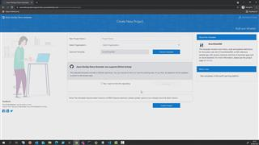

# 00 - Create an Azure DevOps project using the Azure DevoOps Demo Generator  

1. Launch the [Azure DevOps Demo Generator](https://azuredevopsdemogenerator.azurewebsites.net/).
2. Sign in using an account that is already an Azure DevOps user [(go here -> Start free)](https://azure.microsoft.com/en-us/services/devops/?nav=min#overview)
3. Select your organization you want to publish the project to.
4. Choose template -> Private -> 'github' -> and use the URI (copy&paste) [https://github.com/CSA-OCP-GER/avdpoc/blob/main/AzureDevopsDemoGenerator.zip](https://github.com/CSA-OCP-GER/avdpoc/blob/main/AzureDevopsDemoGenerator.zip)
5. **Submit**.
6. Select your org again + give the project a name e.g. **myAVD PoC Project**
7. Hit **Create Project**
8. Once finished -> Navigate to project.  

## Here is a video that shows how:  

[next](./../01-createserviceprincipal/readme.md)