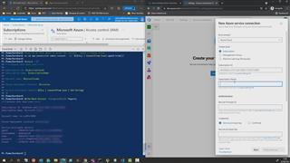

# 02 - Create an Azure Devops Service Connection using the service principal

1. In Azure Devops -> %Your AVD Project% -> Project Settings -> Pipelines / Service Connections -> New service connection
2. Choose 'Azure Resource Manager' -> Service principal (manual)    so that we can enter our pre created SP from the previous lab.
3. Fill in with the values received when doing the previous lab.
4. Hit 'Verify and save' 

## Here is a video that shows how:  

[next](./../03-editenvironmentfile/readme.md)