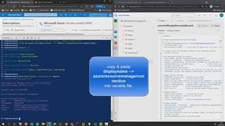

# 03 - Edit your environment file to change where & what will be deployed in the PoC

1. In Azure Devops -> %Your AVD Project% -> Repos -> Expand 'pipelines' -> click on '*yourenvfile.pipeline.variables.yml*'  to view the contents:

```yaml
variables:

# Target subscription and service principal
# -------------
  azureResourceManagerConnection: 'myDevopsSP'
  artifactDropName: 'drop'
  keyvaultname: kv-avdPoc...  # enter the full name of your key vault -> holds the Sprincipal password - fill with exact name with output you received when running the CreateDevopsSP.ps1 - or lookup the keyvault name in your azure subscription

# Storage account for deployment artefacts (e.g. PowerShell scripts)
  saPrefix: saavdart

# RGs deployment location and network
  pipelineName: 'AVD PoC ClassicDCandJumpHost pipeline'
  location: 'northeurope'    #westeurope, germanywestcentral, ...
  .
  .
  .

```
> **Note:** This yaml file is used as variable file for the Azure DevOps pipelines. It will let the pipeline know which Service connection to use thus it will influence which Azure subscription will be used for deployment. When running a pipeline you will be asked which variable file to use. Additionally it contains values for which IP address ranges to use, the name of the domain, resource groups,... You can copy this file to target e.g. multiple environments / subsrciptions from one project. Or you edit this file to reflect your wishes - handle with care i.e. don't edit all at once - make suble changes - and make a backup of the original one before ;-)


2. Hit '**Edit**' button on the top right corner.
3. **Make sure you enter the correct values for the variables**:  
   - ***azureResourceManagerConnection***
   - ***keyvaultname***
   - all occurrences of ***location*** 
  
you got the values from [Challenge 01 - Create Service Principal](../01-createserviceprincipal/readme.md) 

4. Hit 'Commit' to persist the changes.


## Here is a video that shows how:  
[](https://youtu.be/IxMRPI9lehQ)

[next](./../04-deploylandingzone/readme.md)  
[back](../../README.md)
