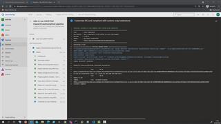

# 04 - Run the pipeline that will deploy your Azure AVD landing zone (= deployment requirements)

Azure Virtual Desktop required (in the past) an Active Directory (in sync with an Azure AD (AAD)).  
Nowadays this requirement is gone - however I'd expect a lot of environments will make use of an AD. E.g. customer is using M365 already or legacy applications that should be hosted require a domain user to authenticate & authorize.  
Therefore this PoC targets the classic requirement of an AD.

## The pipeline '1_Deploy AVD PoC Landing Zone (requirements) pipeline ('Greenfield')' will deploy

  
a network with subnets, a domain controller and a jumphost for you.  
>**Note**: Have a look at your environment variable file (aka *'yourenvfile.pipeline.variables.yml'*). You'll find the details there.

## To run the *'1_Deploy AVD PoC Landing Zone...'* pipeline you go

1. In Azure Devops -> %Your AVD Project% -> Pipelines -> All -> click *1_Deploy AVD PoC Landing Zone (requirements) pipeline ('Greenfield')* -> Run pipeline
2. Enter a name for the adminAccount (= domain admin account) e.g.:  avdadmin    (***Important***: **Do not use admin nor administrator**)
3. Enter a ***strong*** adminPassword (when the jumphost is running it'll be on the internet - you don't want someone hack your server.)

>*Note*: **Azure wants strong passwords** e.g. for windows VMs: **12 character minimum: lower + upper case charakter + 3 or more special chars**. Otherwhise the deployment will fail (or your VMs are vulnerable). Please do so to save yourself some time ;-)

4. Hit **Run.**

## Here is a video that shows how:  

[next](./../05-adandaadsync/readme.md)  
[back](../../README.md)

