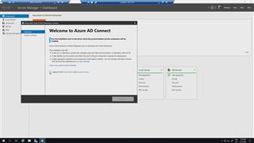

# 05 - Sync AD with Azure AD (AAD) using AD Connect

After our landing zone - has been deployed (in the previous challenge) we have a look at the environment.

1. Log on to your jumphost: [Azure Portal] -> Virtual Machines -> ...jumphost -> Connect -> RDP
2. Use the credentials you used in the previous challenge. And log on using the domain. Your jumphost should be domain joined.  

In my case username is: *contoso\avdadmin*  
password: *%the one I used in previous challenge%*  
  
3. In the jumphost - show yourself around (e.g. launching the 'AD Users & Computers') - e.g. find the name of your domain controller
4. On the jumphost run: mstsc.exe -> %your domain controller%
5. Launch AD Connect installation -> c:\temp\AD Connect.....
6. Use Express settings.
7. Log on to your AAD as global admin.
8. Log on to your AD as *avdadmin*
9. Establish the sync -> Wait -> Check the [Azure Portal] -> Azure Active Directory -> Users for synced users.

## Here is a video that shows how:  
  

[next](./../06-deployavd/readme.md)  
[back](../../README.md)
