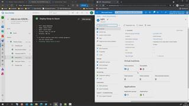
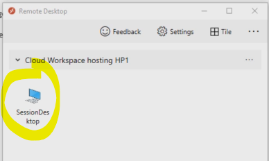
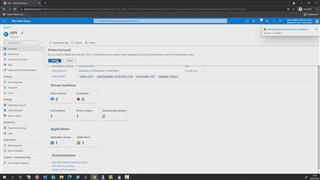

# 06 - Deploy an AVD hostpool (with session hosts) using an Azure DevOps pipeline  

Now it's time to deploy some AVD stuff.  
The pipeline *'2.0_AVD Hostpool Complete Sample Pipeline'*  
will deploy an Azure Virtual Desktop hostpool with 2 session hosts (desktops) + an application group and a workspace.
It'll use an Azure CLI task to deploy an Azure bicep file.  
  
1. In Azure Devops -> %Your AVD Project% -> Pipelines -> All -> click *'2.0_AVD Hostpool Complete Sample Pipeline'*  -> Run pipeline
2. Enter a username for a account that can join computers to a domain (in my case I use the domain admin account I was using in previous challenges =avdadmin)
3. Enter the users password.
4. Hit **Run.**

## Here is a video that shows how  

## Test: Connect to your desktop

1. Download & install the right AVD client for your OS - e.g. [Win 64-bit](https://docs.microsoft.com/en-us/azure/virtual-desktop/user-documentation/connect-windows-7-10)
2. Subscribe using a demo user e.g. **avduser1@**%YourAAD%**.onmicrosoft.com**  
(see [Azure Portal] -> Azure Active Directory -> Users)
3. Type in your password.
4. Now you should see a desktop has been published for you:

  
5. Double-click the desktop icon and logon using your domain credentials: e.g. avduser1@contoso.local  
(or your domain - in case you changed that in the var file.)  
  
## (optional) To cleanup  

If you want to remove hosts (e.g. because you want to rerun the pipeline) - cleanup by doing:
- [Azure Portal] -> Azure Virtual Desktop -> Host Pools -> HP1 -> Session Hosts -> select all session hosts -> Remove
- [Azure Portal] -> Resource Groups -> select your %resourceGroupHostPool% (e.g. rg-avdPoC-HP1) -> select all resources -> remove.

[back](../../README.md)
