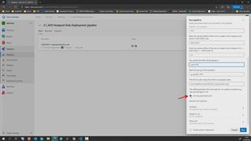

# 07 - Create AVD Hostpool and desktops only (i.e. without App Group nor Workspace)

1. In Azure Devops -> %Your AVD Project% -> Pipelines -> All -> click *'2.1_AVD Hostpool Only Deployment pipeline'*
2. Enter a username for a account that can join computers to a domain (in my case I use the domain admin account I was using in previous challenges =avdadmin)
3. Enter the users password.
4. Enter the name of the HostPool to create (e.g 'HP1')
5. Enter a name to be used as prefix for the VMs (aka desktops aka session hosts)  (e.g. 'AVD-HOST')
6. Enter a comma separated list (arry) of names for the desktops to create (e.g. '0,1')
   - this will result in VMs: AVD-HOST-0 and AVD-HOST-1 to be created
7. Enter a name for the subnet that should be used for placing the VMs into. (e.g. 'snet-HP1')
8. Enter the resource group name for the VMs to be placed into. (e.g. 'rg-avdPoC-HP1')
9. Enter an organizational unit (OU) where the VMs to be placed in Active Directory. (e.g. 'OU=HostPool1,OU=AVD,DC=contoso,DC=local')
10. Hit **Run.**

## Here is a video that shows how  

If you want to remove hosts (e.g. because you want to rerun the pipeline) - cleanup by doing:  

- [Azure Portal] -> Azure Virtual Desktop -> Host Pools -> HP1 -> Session Hosts -> select all session hosts -> Remove
- [Azure Portal] -> Resource Groups -> select your %resourceGroupHostPool% (e.g. rg-avdPoC-HP1) -> select all resources -> remove.

[back](../../README.md)
