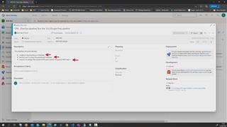
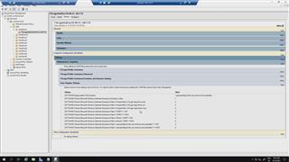

# 08.1 - Create Azure Premium Fileshare for FSLogix

1. In Azure Devops -> %Your AVD Project% -> Pipelines -> All -> click *'3.0_FSLogix Prep pipeline'*  
2. Hit **Run.**

## Here is a video that will show what happens

# 08.2 - Create GPO for FSLOGIX profile share

1. In Azure Devops -> %Your AVD Project% -> Pipelines -> All -> click *'3.1_FSLogix Create GPO pipeline'*
2. Enter the upper OU path i.e. the part without the domain (e.g. 'OU=HostPool1,OU=AVD')
3. Enter the name of the storage account that was created in the previous pipeline (it should start with 'saavdprofiles...')
4. Enter the name of the profile share use 'avdprofiles' (if you haven't changed the value in your yourenvfile.pipeline.variables.yml)
5. Hit **Run.**

## Here is a video that shows how  

  

[back](../../README.md)
