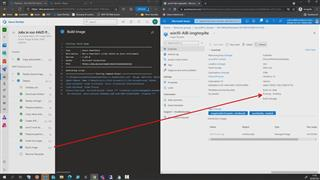

# 09 - Creating A VM Image Using Azure Image Builder Pipeline

1. In Azure Devops -> %Your AVD Project% -> Pipelines -> All -> click *'4.0_Create A Basic VM Image With Azure Image Builder (AIB) pipeline'*  
2. Hit **Run.**

## Here is a video that will show what happens

[back](../../README.md)
