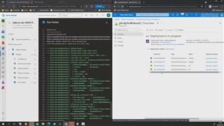

# 10 - Creating  A Custom VM Image in Azure Using Packer Devops Pipeline

1. In Azure Devops -> %Your AVD Project% -> Pipelines -> All -> click *'4.1_Create A Localized VM Image Using Packer pipeline'*  
2. Hit **Run.**

## Here is a video that will show what happens

[back](../../README.md)
