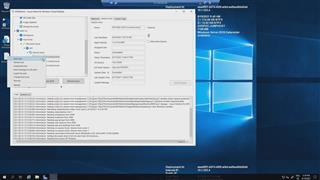

# 11 - Installing & Using WVD Admin tool (3rd party) For Administration Of AVD

The [WVD Admin]([https://link](https://blog.itprocloud.de/Windows-Virtual-Desktop-Admin/)) tool can make your day to day operations of an AVD setup easier.

1. In Azure Devops -> %Your AVD Project% -> Pipelines -> All -> click *'5.0_Install WVD Admin On Jumphost (3rd Party tool) pipeline'*  
2. Hit **Run.**

## Here is a video that will show what happens

[back](../../README.md)
