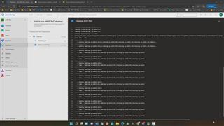

# Cleanup - Executing The 'Remove Procedure Pipeline'

1. In Azure Devops -> %Your AVD Project% -> Pipelines -> All -> click *'Cleanup Pipeline !Warning! will erase azure PoC environment'*  
2. Hit **Run.**
3. Once the pipeline has finished - delete the service principal

[Azure Portal] -> Azure Active Directory -> App registrations -> 'Owned applications' -> 'myDevopsSP' -> Delete

4. Delete your Azure Devops Project.

[Azure Portal] -> Azure Active Directory -> App registrations -> 'Owned applications' -> 'myDevopsSP' -> Delete

## Here is a video that will show what happens

[back](../../README.md)
